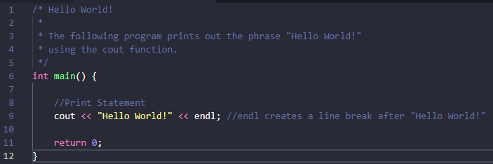

# Data-Structures-and-Algorithms-in-cpp
This repository is in development phase and will soon provide you with C++ code of various data structures and algorithms.

# User Guide

## What is this for?
This project is designed to be a reference for anyone needing to implement a particular data structure or algorithm into their C++ program.

## How to Use
* Find the folder with the name of your Data Structure or Algorithm
* Browse C++ implementations of your chosen topic
  * Your topic isn't there?
  * Consider contributing to help fill the gaps

# Contribution Guide

## Who can contribute?
Anyone can contribute to this repository.

## How to Contribute
1. Fork this repository
2. Pick up an algortihm
3. Write your C++ code
4. Follow the File Placement guide below
5. Create a pull request
6. Star the repository to show your support

## File Placement Instructions
* Look for a folder for the topic you wish to contribute in (ex. Trees, Sorting, etc.)
* If your particular Data Structure or Algorithm folder exists, add the relevant files there
* If a folder does not exist, create a new one for your topic

## Code Guidelines
* Code should be properly commented so as to ensure it's readability.
* If you've added code that should be tested, add tests as comments. 
* Make sure your code is properly formatted.

   
  <style="font-size: .8em">Example of good documentation</>

  
